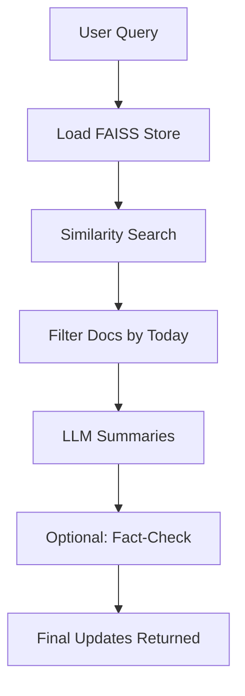
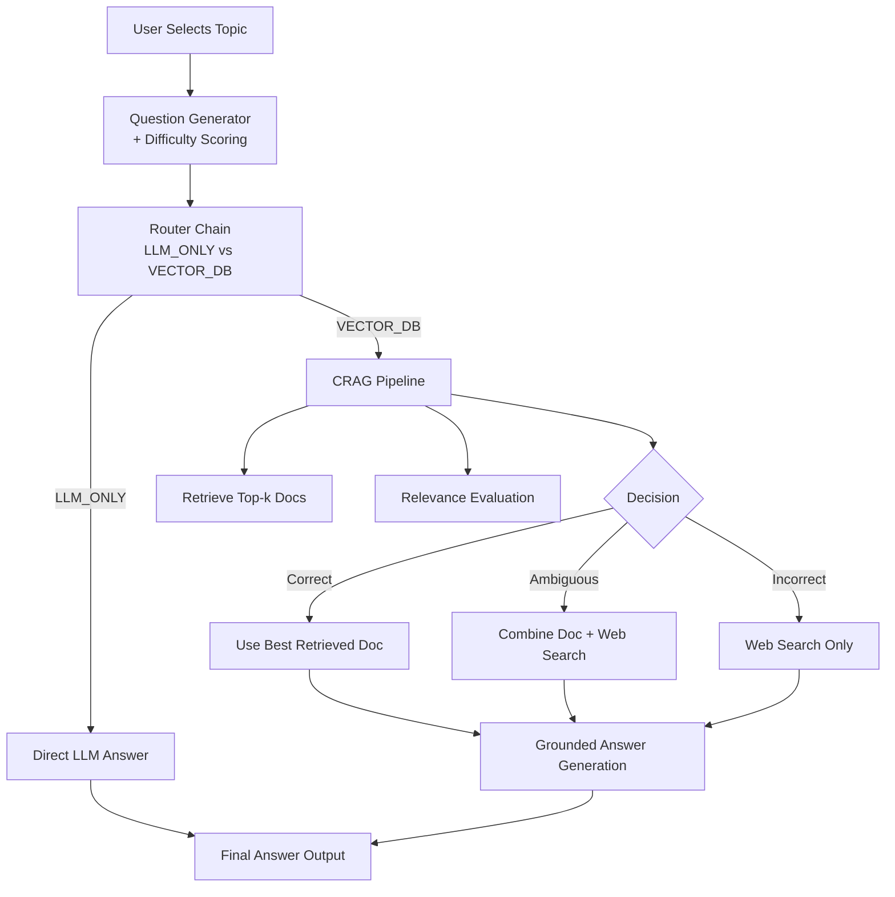
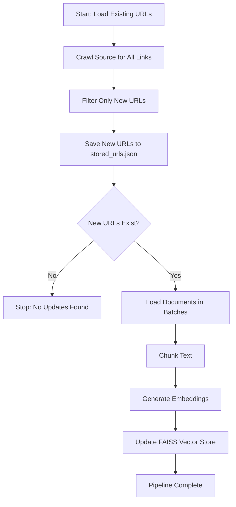

# 🚀 LLM Pulse – Intelligent Data Ingestion, Vectorization & Mock-Interview Reasoning System

LLM Pulse automates web content ingestion, vectorizes knowledge, and powers multiple downstream LLM applications — including **daily LLM updates retrieval**, **semantic search**, and a **Mock Interview system enhanced with CRAG (Corrective RAG)**.

---

# 📰 1. LLM Daily Updates Retrieval Pipeline


This pipeline extracts **today’s newly ingested content**, summarizes it using LLMs, and delivers crisp daily updates for any user-selected topic.

## Workflow



### Output Example

```
Source: https://ragyfied.com/articles/attention-is-all-you-need-explained
Summary: Detailed breakdown of attention mechanisms in modern LLMs...
```

---

# 🎯 2. Mock Interview Pipeline 

* **Adaptive question generation**
* **Router Chain decision-making**
* **CRAG (Corrective Retrieval-Augmented Generation)**
* **Web + Vector + LLM reasoning fusion**

---

## 🧠 End-to-End Mock Interview Workflow



---

## 🧩 Core Components

### **1. Question Generator**

* Produces topic-aligned technical interview questions.
* Auto-assigns difficulty labels (Easy/Medium/Hard).
* Ensures coverage of both theory and practical depth.

### **2. Router Chain**

Optimizes cost + accuracy by making per-question decisions:

| Path        | When Used                                              |
| ----------- | ------------------------------------------------------ |
| `LLM_ONLY`  | The model can reliably answer from internal knowledge. |
| `VECTOR_DB` | When grounded retrieval is required.                   |

### **3. CRAG (Corrective RAG)**

Improves standard RAG by evaluating retrieval quality and applying corrections.

#### CRAG Decision Logic

| Relevance Score | Action                                       |
| --------------- | -------------------------------------------- |
| > 0.7           | Use document directly                        |
| 0.3–0.7         | Combine doc + refined knowledge + web search |
| < 0.3           | Skip docs → web search                       |

---

## 📘 Example Traces

### Router Output

```
LLM_ONLY — The model has sufficient internal knowledge for this question.
```

### CRAG Evaluation

```
Retrieved 7 documents
Scores: [0.2, 0.8, 0.4, 0.2, 0.2, 0.0, 0.2]
Decision: Correct — Using retrieved document
```

---

# 📥 3. LLM Data Ingestion & Vectorization Pipeline

A fully automated workflow that crawls new articles daily, deduplicates URLs, chunks text, generates embeddings, and stores everything inside a **FAISS vector database**.

### 🔧 Key Capabilities

* Automated **daily crawling** of selected sources
* Deduplication via persistent `stored_urls.json`
* Batch-safe document loading
* Configurable chunking
* Embedding with `sentence-transformers/all-MiniLM-L6-v2`
* Incremental FAISS updates (no full rebuild)
* Detailed logging for reliability
* Designed for extensibility (multiple sources, custom loaders, new formats)

---

## 🔄 Ingestion Workflow



---

## 🗂️ Vector Store Document Schema

Each FAISS entry is stored as:

```python
Document(
    id="uuid",
    metadata={
        "source": "...",
        "title": "...",
        "description": "...",
        "language": "en",
        "fetched_at": "YYYY-MM-DD"
    },
    page_content="Chunked document text..."
)
```

---

## ▶️ Running the Pipeline

```bash
pip install -r requirements.txt
python pipeline.py
```

---

# 📁 Project Folder Structure

```
LLM-pulse/
│
├── ingestion/
│   ├── crawler.py
│   ├── chunker.py
│   ├── embeddings.py
│   ├── data_loader.py
│   ├── vector_store_updater.py
│
├── latest_updates/
│   ├── retriever.py
│   ├── summarizer.py
│
├── mock_interview/
│   ├── question_generator/
│   │   └── generator.py
│   ├── router/
│   │   └── router.py
│   ├── crag/
│   │   └── crag.py
│   └── pipeline.py
│
├── llm_chains/
│   └── llm_chains.py
│
├── vectorstore/
│   └── vectorstore.py
│
├── prompts/
│   └── prompt_templates.py
│
├── constants.py
├── embedder.py
├── logging_config.py
├── main.py
├── requirements.txt
└── README.md
```

---

